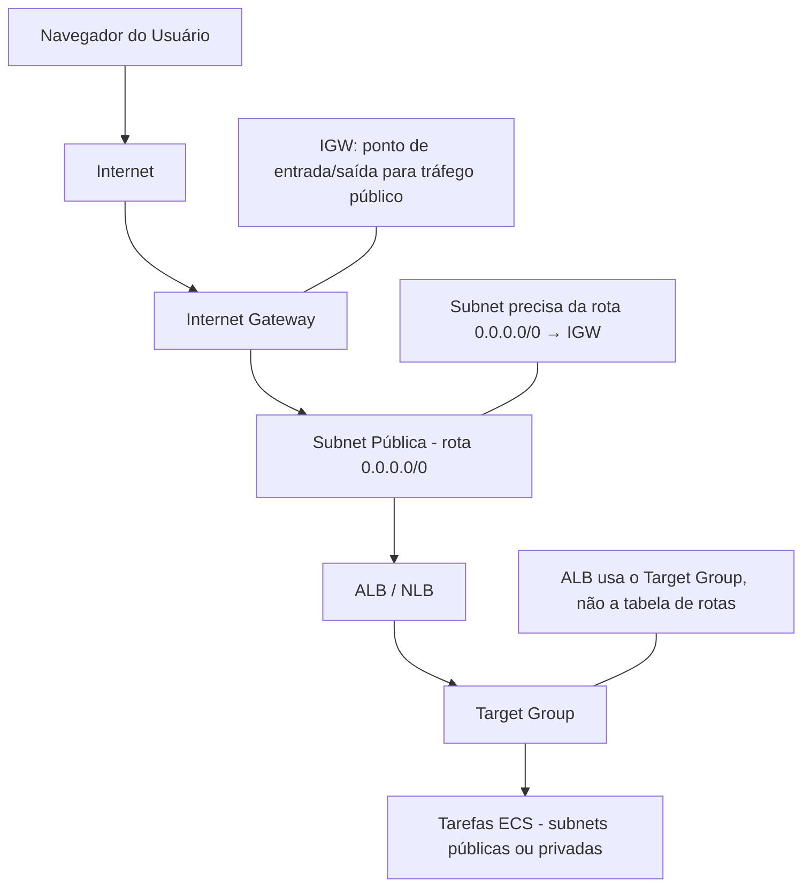

### Requisição do Cliente
`Usuário (navegador) → Internet → Internet Gateway (IGW) → Subnet pública (rota 0.0.0.0/0) → ALB/NLB`

>O IGW é o único ponto de entrada/saída para tráfego público em uma VPC (AWS Docs).

### Roteamento para o ALB/NLB
`Internet Gateway (IGW) → Subnet pública (rota 0.0.0.0/0) → ALB/NLB`

>A tabela de rotas da subnet precisa conter a rota 0.0.0.0/0 → igw para permitir que o ALB receba tráfego externo. (Fonte: AWS Docs)

### Distribuição para ECS
`ALB/NLB → Target Group → Tarefas ECS (em subnets públicas ou privadas)`

>O ALB utiliza o registro no Target Group (não a tabela de rotas) para encaminhar requisições às tarefas ECS. (Fonte: AWS ECS Docs)

## Esquema

