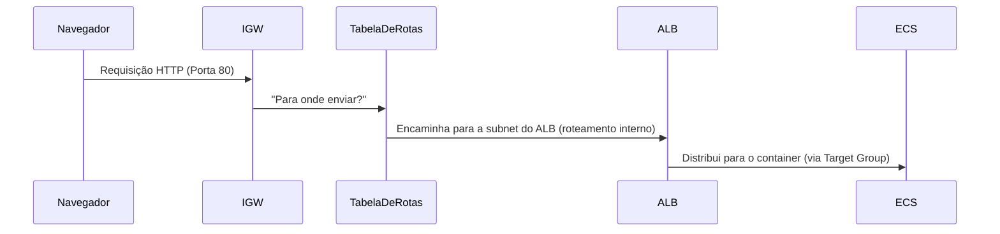

### Requisição do Cliente
`Navegador → Internet → IGW (Internet Gateway)`

>O IGW é o único ponto de entrada/saída para tráfego público em uma VPC (AWS Docs).

### Roteamento para o ALB/NLB
`IGW → Tabela de Rotas da Subnet → ALB/NLB`

>A tabela de rotas da subnet precisa da rota 0.0.0.0/0 → igw para permitir que o >ALB receba tráfego externo (AWS Docs).

### Distribuição para ECS
`ALB → Target Group → Tarefa ECS`

>O ALB usa o registro no Target Group (não a tabela de rotas) para encontrar as >tarefas ECS (AWS ECS Docs).


## Esquema



## 🔍 Por Que Usamos o DNS do Load Balancer?
### Abstração de Infraestrutura

O IGW só sabe entregar tráfego para IPs públicos das subnets, mas não para serviços específicos.

O ALB/NLB esconde a complexidade: seu DNS aponta para IPs rotacionados (por trás dele estão as subnets com rotas para o IGW).

### Escalabilidade e Alta Disponibilidade

O DNS do ALB/NLB balanceia automaticamente entre múltiplas subnets públicas (ex: us-east-1a, us-east-1b), enquanto o IGW só enxerga subnets individuais.

### Gerenciamento de Ciclo de Vida

Se você substituir instâncias/containers, o DNS do ALB permanece o mesmo, enquanto os IPs internos mudam.
```mermaid
flowchart LR
    A[Usuário] -- "meu-alb-1234.elb.amazonaws.com" --> B[DNS → IPs Públicos do ALB]
    B --> C[IGW]
    C --> D[Tabela de Rotas da Subnet]
    D --> E[ALB]
    E --> F[ECS]